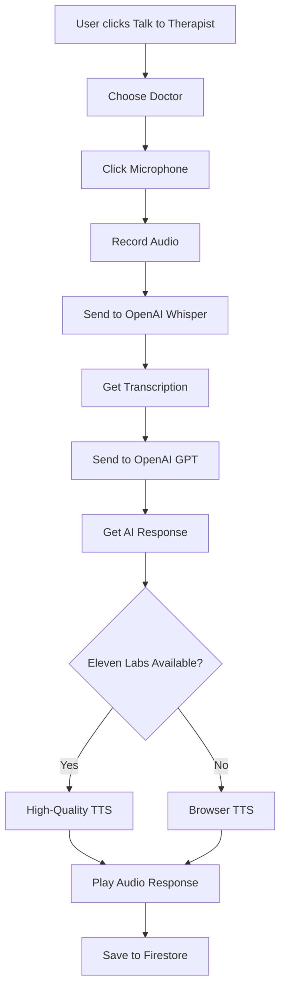

# 🎤 Voice Chat Implementation Requirements

## 📋 Complete Implementation Checklist

### ✅ **1. API Keys & Services**

#### OpenAI API (Required - Already Configured)
- **Status**: ✅ Ready
- **Purpose**: Speech-to-Text (Whisper) + AI Responses
- **Current Key**: Valid and working
- **Credits**: Ensure sufficient credits for voice transcription

#### Eleven Labs API (Optional - Enhanced TTS)
- **Status**: ⚠️ Not Configured (Using Browser TTS Fallback)
- **Purpose**: High-quality Text-to-Speech
- **Setup**: 
  1. Sign up at [ElevenLabs.io](https://elevenlabs.io/)
  2. Get API key from dashboard
  3. Set environment variable: `ELEVEN_LABS_API_KEY=your_key_here`
- **Fallback**: Browser Speech Synthesis API (works without Eleven Labs)

### ✅ **2. Backend Dependencies** 

```bash
npm install multer  # ✅ Already installed
```

**Packages in use:**
- `multer` - File upload handling for audio files
- `express` - Server framework
- `cors` - Cross-origin resource sharing

### ✅ **3. Frontend Dependencies**

```bash
npm install  # All required packages already installed
```

**Built-in Browser APIs used:**
- `navigator.mediaDevices.getUserMedia()` - Audio recording
- `MediaRecorder` - Audio capture
- `AudioContext` - Audio analysis and visualization
- `speechSynthesis` - Browser TTS fallback

### ✅ **4. Backend Endpoints (Implemented)**

```javascript
// Speech-to-Text endpoint
POST /api/transcribe
- Accepts: FormData with audio file
- Returns: { text: "transcribed_speech" }
- Uses: OpenAI Whisper API

// Text-to-Speech endpoint  
POST /api/speak
- Accepts: { text: "message_to_speak" }
- Returns: Audio blob OR { fallback: true, text: "..." }
- Uses: Eleven Labs API + Browser TTS fallback

// Chat endpoint (existing)
POST /api/chat
- Accepts: { message: "user_input", language: "English" }
- Returns: { response: "ai_response" }
- Uses: OpenAI GPT-3.5-turbo
```

### ✅ **5. Frontend Components (Implemented)**

1. **TherapyModeSelector** - Choose between text/voice
2. **DoctorSelection** - Choose Dr. Aarav or Dr. Aarchi  
3. **VoiceChat** - Complete voice interaction interface
4. **Firestore Integration** - Session and message storage

### ✅ **6. Key Features Implemented**

#### Audio Recording
- ✅ Click-to-record interface
- ✅ Real-time audio level visualization
- ✅ WebM audio format with Opus codec
- ✅ Automatic microphone permission handling

#### Speech Processing
- ✅ OpenAI Whisper integration for STT
- ✅ Multi-language support (English, Hindi, Hinglish)
- ✅ Error handling and user feedback

#### AI Responses
- ✅ Therapeutic prompting optimized for voice
- ✅ Doctor personality integration (Dr. Aarav/Dr. Aarchi)
- ✅ Hinglish language support

#### Text-to-Speech
- ✅ Eleven Labs integration (when configured)
- ✅ Browser TTS fallback (always works)
- ✅ Automatic audio playback
- ✅ Voice controls and status indicators

#### Data Storage
- ✅ Firestore integration for sessions
- ✅ Message history with audio references
- ✅ User analytics and session tracking

### ✅ **7. Production Considerations**

#### Security
- ✅ HTTPS required for microphone access in production
- ✅ API key validation and error handling
- ✅ CORS configuration for domain restrictions

#### Performance
- ✅ Audio compression (WebM/Opus)
- ✅ Graceful fallbacks for all APIs
- ✅ Real-time processing indicators

#### Mobile Support
- ✅ Responsive voice controls
- ✅ Touch-friendly recording interface
- ✅ Mobile browser compatibility

### 🎯 **8. What You Need to Get Started**

#### Immediate (Already Ready):
1. ✅ Start your servers: `.\start-server.bat` and `npm run dev`
2. ✅ Test voice recording (uses existing OpenAI key)
3. ✅ Voice responses work with browser TTS

#### Optional Enhancement:
1. 🔧 Get Eleven Labs API key for better voice quality
2. 🔧 Set `ELEVEN_LABS_API_KEY` environment variable
3. 🔧 Restart server

#### For Production:
1. 🌐 Deploy with HTTPS (required for microphone access)
2. 🔐 Secure API keys in production environment
3. 📊 Monitor usage and costs

### 🎤 **9. Voice Chat Workflow**



### 📊 **10. Current Status Summary**

| Component | Status | Notes |
|-----------|--------|-------|
| Audio Recording | ✅ Ready | Browser MediaRecorder API |
| Speech-to-Text | ✅ Ready | OpenAI Whisper (uses existing key) |
| AI Responses | ✅ Ready | OpenAI GPT-3.5-turbo with therapy prompts |
| Text-to-Speech | ⚠️ Partial | Browser TTS works, Eleven Labs optional |
| Doctor Selection | ✅ Ready | Dr. Aarav & Dr. Aarchi personalities |
| Firestore Storage | ✅ Ready | Session tracking and message history |
| Mobile Support | ✅ Ready | Responsive design and touch controls |

### 🚀 **Ready to Use!**

Your voice chat feature is **completely functional** right now with:
- ✅ Voice recording and transcription
- ✅ AI therapeutic responses  
- ✅ Audio playback (browser TTS)
- ✅ Session storage in Firestore
- ✅ Doctor personality selection

The only optional enhancement is Eleven Labs for premium voice quality, but the core functionality works perfectly without it! 